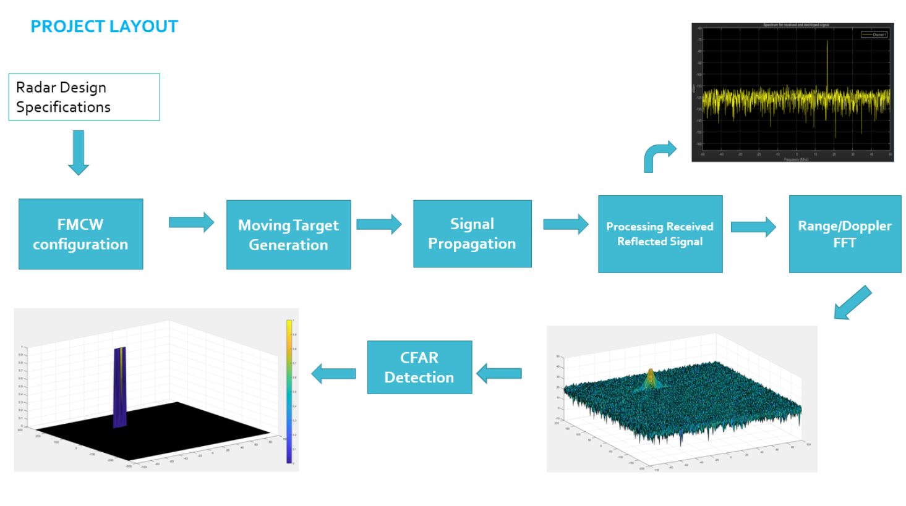
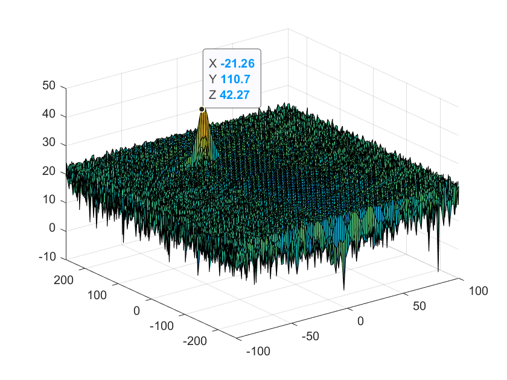
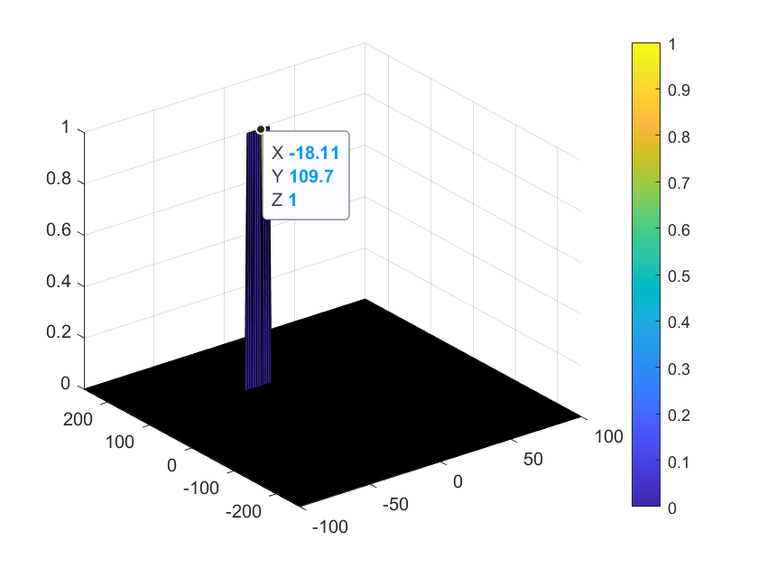

# Radar Target Generation and Detection

## What is this Project? 

This is a project of Udacity Sensor Fusion Engineer Nano-degree, about radar signal processing. 

This creates a simulated radar signal on simulated moving target. Then analyzes the reflected signal to estimate the distance and the velocity

The detailed steps are as below: 

1. Radar Design Specifications, set as below: 
    - Frequency: 77 GHz
    - Max Range: 200m
    - Max Velocity: 70m/s
    - Range Resolutuon: 1m 
    - Velocity Resolutuon: 3m/s 

2. FMCW Waveform Configuration - changing frequency liniearly along with time, with following settings: 
    - sweeptime: set as x10 of max travel time
    - bandwidth, slope: calculated from all settings above

3. Moving Target Generation - by setting the initial distance and the veolocity 
    - Initial distance: 110m (from the radar)
    - Veolocity: -20m/s 

4. Signal Propagation 

5. Process received signals to estimate the position and veolocity set above, with following steps: 
    - 2D FFT 
    - 2D CFAR
       -  Implementation steps: 
           - Loop over each cell from FFT data, that is standardized by dividing by max value  
           - 
           - 
           - If the cell value is larger than the noise + offset, the CFAR value is 1, other wise 0
       -  Selection of training cells, guard cessl and offset are as below: 
           - Training cells: 10 x 8 (range x velocity(doppler))
           - Guard cells: 4 x 4 
           - Offset for threshold: 1.0
        - Non-thresholded cells at the edges: cells at the egets were not considered from the beginning
 

 ## Result Images 

 #### 2D FFT 

 

 Not bad detection of distance (110), and velocity (-20)

  

 #### 2D CFAR

 

 ## Running Environment 

 - This is written in Matlab and need to install Matlab to run this

 ## Reference

 - The fundamentals of millimeter wave sensors http://www.ti.com/lit/wp/spyy005/spyy005.pdf
 - https://www.slideshare.net/tobiasotto/principle-of-fmcw-radars
 - https://www.radartutorial.eu/02.basics/Frequency%20Modulated%20Continuous%20Wave%20Radar.en.html
